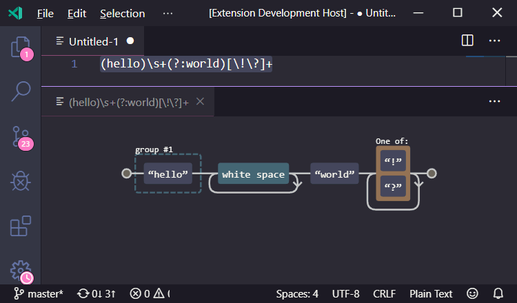

# Regexper **Unofficial**

This extension is based on [Jeff Avalone](jeff.avallone@gmail.com)'s work, the [Regexper site](https://regexper.com/).

## Features

This extension show the current regex on another panel:

## Use
Put the cursor on a string or select a piece of text and select `Draw current regex` on [command palette](https://code.visualstudio.com/docs/getstarted/userinterface#_command-palette.)

## Requirements

If you have any requirements or dependencies, add a section describing those and how to install and configure them.

## Extension Settings

* `regexper-unofficial.useOnePanel` **TODO** if setted the same panel is recycled for every view.

## Known Issues

Calling out known issues can help limit users opening duplicate issues against your extension.

## Release Notes

See changelog for more ingformation
